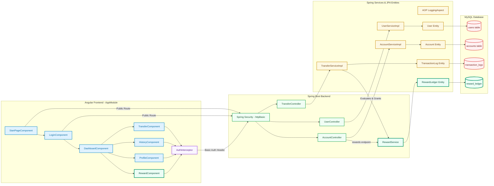

# Money Transfer System: Architecture & Presentation Reference

This document provides a comprehensive review of the technologies implemented in your project, explains the newly integrated **Rewards Module**, provides copy-pasteable **Mermaid architecture diagrams** that can be directly imported into **Draw.io**, and outlines a concise **4-slide presentation** deck.

---

## 1. Technical Stack Analysis & Implementation Verification

We inspected the codebase to verify your specific architectural details:

### A. Authentication: HTTP Basic Authentication
*   **Backend Verification:** Implemented using standard Spring Security.
    *   [SpringSecurityConfig.java](file:///c:/Users/user/Desktop/Capstone/MTS_Batch3/backend/MoneyTransferSystem/src/main/java/com/fidelity/mts/security/SpringSecurityConfig.java) registers a `BCryptPasswordEncoder` bean and configures an `InMemoryUserDetailsManager` containing an admin user (`admin` / `1234` encoded).
    *   All endpoints under `/api/v1/users/**` are permitted publicly to allow registration and login, while all other endpoints require authenticated requests verified via `.httpBasic()`.
*   **Frontend Verification:** 
    *   [auth-interceptor.ts](file:///c:/Users/user/Desktop/Capstone/MTS_Batch3/frontend/mts-ui/src/app/interceptors/auth-interceptor.ts) intercepts every outgoing HTTP request. If a secure token (Base64 credential) exists, it injects the `Authorization` header with the `Basic <token>` signature. Public user endpoint requests are bypassed.

### B. Database Access: Spring Data JPA & Hibernate
*   **ORM and Database:** The project uses **Spring Data JPA** with Hibernate as the provider, connecting to a local **MySQL 8.x** instance (`mts_test`).
*   **Repositories:** Database interactions are structured around repository interfaces extending `JpaRepository` (e.g., `UserRepository`, `AccountRepository`, `TransactionLogRepository`, and `RewardLedgerRepository`).
*   **Hibernate DDL-Auto:** Enabled via `spring.jpa.hibernate.ddl-auto = update` in [application.properties](file:///c:/Users/user/Desktop/Capstone/MTS_Batch3/backend/MoneyTransferSystem/src/main/resources/application.properties#L7), letting Hibernate dynamically map entities (like `User`, `Account`, `TransactionLog`, `RewardLedger`) to tables on startup.
*   **No Raw JDBC:** Database access fully leverages JPA repositories without explicit JDBC templates.

### C. Frontend Architecture: Hybrid NgModule & Standalone Component Setup
*   **NgModule Structure:** The root application imports and registers dependencies in [app-module.ts](file:///c:/Users/user/Desktop/Capstone/MTS_Batch3/frontend/mts-ui/src/app/app-module.ts). It declares the primary pages: `LoginComponent`, `StartPageComponent`, `DashboardComponent`, `HistoryComponent`, and `ProfileComponent`.
*   **Standalone Components:** Features like [transfer-component.ts](file:///c:/Users/user/Desktop/Capstone/MTS_Batch3/frontend/mts-ui/src/app/components/transfer-component/transfer-component.ts) and [reward-component.ts](file:///c:/Users/user/Desktop/Capstone/MTS_Batch3/frontend/mts-ui/src/app/components/reward-component/reward-component.ts) are configured as modern standalone components (`standalone: true`).

---

## 2. Rewards Module: Design & Implementation Details

The Rewards Module acts as a transactional listener that evaluates completed transfers on the fly.

### A. Eligibility Rules (Implemented in `RewardService`)
A transaction receives points only if it meets all of the following rules:
1.  **Transaction Success:** Status is `TransactionStatus.SUCCESS` ([RewardService.java:L73](file:///c:/Users/user/Desktop/Capstone/MTS_Batch3/backend/MoneyTransferSystem/src/main/java/com/fidelity/mts/service/RewardService.java#L73)).
2.  **Minimum Amount Threshold:** Amount is **$100 or more** (`amount >= 100`) ([RewardService.java:L77-L79](file:///c:/Users/user/Desktop/Capstone/MTS_Batch3/backend/MoneyTransferSystem/src/main/java/com/fidelity/mts/service/RewardService.java#L77-L79)).
3.  **Different Users / No Self-Transfers:** Senders cannot transfer money to their own account to earn points. Checked via `fromAccountId != toAccountId` ([RewardService.java:L81-L83](file:///c:/Users/user/Desktop/Capstone/MTS_Batch3/backend/MoneyTransferSystem/src/main/java/com/fidelity/mts/service/RewardService.java#L81-L83)).

### B. Reward Point Calculation
*   **Formula:** `1` point is granted for every `$100` of the transaction amount.
*   **Precision:** Points are rounded down using integer division to prevent floating-point errors.
    *   *Example 1:* `$250` transfer $\rightarrow$ `2` points.
    *   *Example 2:* `$99` transfer $\rightarrow$ `0` points (fails minimum threshold).

### C. Backend Architecture Detail
*   **Persistence:** Points are saved in the `reward_ledger` table via the `RewardLedger` Entity.
*   **Transaction Hook:** Within `TransferServiceImpl.executeTransfer(...)`, once a transfer succeeds and the log is written, the rewards processor evaluates eligibility and saves points.
*   **REST Endpoints:**
    *   `GET /api/v1/accounts/rewards/{accountId}`: Retrieves the user's detailed list of earned rewards (timestamp, transaction ID, recipient, points awarded).

---

## 3. Architecture Diagrams (Old vs. New)

These diagrams are written in **Mermaid.js**. 
> [!TIP]
> **To import these directly into Draw.io:**
> 1. Open Draw.io and create a blank page.
> 2. Go to the top menu: **Arrange** $\rightarrow$ **Insert** $\rightarrow$ **Advanced** $\rightarrow$ **Mermaid...**
> 3. Paste the Mermaid code block below and click **Insert**.

#### Diagram A: Old Architecture (Before Rewards Integration)

```mermaid
graph LR
    %% Styling
    classDef client fill:#e0f2fe,stroke:#0284c7,stroke-width:2px,color:#0369a1;
    classDef api fill:#f0fdf4,stroke:#16a34a,stroke-width:2px,color:#14532d;
    classDef domain fill:#fdf8e2,stroke:#ca8a04,stroke-width:2px,color:#713f12;
    classDef db fill:#fef2f2,stroke:#dc2626,stroke-width:2px,color:#7f1d1d;
    classDef config fill:#faf5ff,stroke:#9333ea,stroke-width:2px,color:#581c87;

    subgraph FE [Angular Frontend - AppModule]
        register[StartPageComponent]
        login[LoginComponent]
        dash[DashboardComponent]
        transfer[TransferComponent]
        history[HistoryComponent]
        profile[ProfileComponent]
        interceptor[AuthInterceptor]
    end
    class register,login,dash,transfer,history,profile client;
    class interceptor config;

    subgraph BE [Spring Boot Backend]
        sec[Spring Security - httpBasic]
        uCtrl[UserController]
        aCtrl[AccountController]
        tCtrl[TransferController]
    end
    class sec,uCtrl,aCtrl,tCtrl api;

    subgraph Service_and_Domain_Layer [Spring Services & JPA Entities]
        userService[UserServiceImpl]
        accService[AccountServiceImpl]
        txService[TransferServiceImpl]
        aop[AOP LoggingAspect]
        
        userEnt[User Entity]
        accEnt[Account Entity]
        txLogEnt[TransactionLog Entity]
    end
    class userService,accService,txService,aop,userEnt,accEnt,txLogEnt domain;

    subgraph DB [MySQL Database]
        uTbl[(users table)]
        aTbl[(accounts table)]
        lTbl[(transaction_logs)]
    end
    class uTbl,aTbl,lTbl db;

    %% Connections
    register --> login --> dash
    dash --> transfer & history & profile
    transfer & history & profile --> interceptor
    
    register & login -- "Public Route" --> sec
    interceptor -- "Basic Auth Header" --> sec
    
    sec --> uCtrl
    sec --> aCtrl
    sec --> tCtrl
    
    uCtrl --> userService
    aCtrl --> accService
    tCtrl --> txService
    
    userService --> userEnt
    accService --> accEnt
    txService --> txLogEnt
    
    userEnt --> uTbl
    accEnt --> aTbl
    txLogEnt --> lTbl
```

#### Diagram B: New Architecture (After Rewards Integration)

---

## 4. Presentation Slide Deck Outline (3 - 4 Slides)

Here is a 4-slide structure designed to clearly explain the money transfer project and the new rewards feature.

---

### Slide 1: Money Transfer System
*   **Slide Title:** Money Transfer System
*   **Visual Structure:** Split column layout. Left: Core Business Goals. Right: Modern Tech Stack.
*   **Key Bullets:**
    *   **Core Goal:** A robust, high-performance ledger application for real-time money transfers between accounts.
    *   **Security First:** Secure REST API gateway with **HTTP Basic Auth** stateless session verification.
    *   **Data Integrity:** Multi-account balances with strict ACID isolation, concurrency control (optimistic locking), and detailed transaction audits.
    *   **Tech Stack:** Java 17, Spring Boot 3.x, Spring Data JPA, Spring Security, MySQL 8.x, and Angular 18+.

---

### Slide 2: Implemented Architecture & Integration Points
*   **Slide Title:** System Architecture & Integration Points
*   **Visual Structure:** Side-by-side architecture diagram layouts (using the imported Draw.io diagrams). Left shows the original Money Transfer structure. Right highlights the added Rewards system components.
*   **Key Bullets:**
    *   **Core Structure:** Angular Standalone/NgModule hybrid views communicating with Spring Boot REST API endpoints, supported by JPA Repositories mapping to MySQL schema.
    *   **Rewards Integration:** Sitting on top of the transfer process, the **Rewards Module** connects directly into the transactional database layer.
    *   **Seamless Injection:** Integrated directly inside the backend `TransferServiceImpl`. When a transaction commits successfully, the rewards processor evaluates eligibility and saves points to `reward_ledger`.

---

### Slide 3: Reward Module Design & Business Logic
*   **Slide Title:** Reward Module: Rules & Core Logic
*   **Visual Structure:** Highlight boxes indicating the eligibility rules on the left, and numerical examples of points on the right.
*   **Key Bullets:**
    *   **Eligibility Filters:**
        1.  **Transaction Success:** Reward points are only allocated on completed (`SUCCESS`) transfers.
        2.  **Minimum Value Threshold:** The transfer amount must be $\ge$ $100$.
        3.  **Cross-User Transfers:** Senders cannot transfer money between their own accounts to earn points.
    *   **Points Formula:** Senders earn **1 point for every $100** transferred (rounded down).
        *   *$250$ Transfer $\rightarrow$ $2$ Points*
        *   *$99$ Transfer $\rightarrow$ $0$ Points (Ineligible)*

---

### Slide 4: Frontend Integration & User Experience
*   **Slide Title:** Front-End Architecture & User Experience
*   **Visual Structure:** Bullet points on modular design, paired with simple UI element mockups (Total Points Card and Rewards History table).
*   **Key Bullets:**
    *   **Angular Integration:** The rewards dashboard is implemented in a dedicated standalone component (`RewardComponent`).
    *   **Central API Service:** Extended `RewardService` with client endpoints querying `/api/v1/accounts/rewards/{accountId}`.
    *   **Basic Auth Interceptor:** Reuse the HTTP header clone pattern so that the rewards dashboard loads secure data automatically.
    *   **UI Components:** Designed with clean Bootstrap layouts, showcasing a points summary card and detailed transaction-to-points mapping tables.
